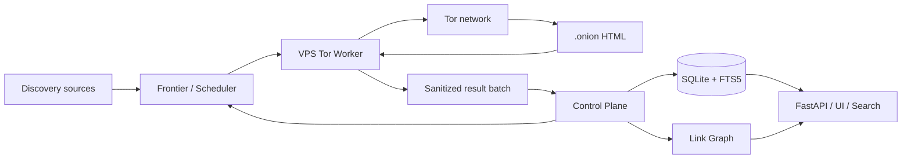

# OnionAtlas

OnionAtlas — автономный движок обнаружения, обхода, индексации и исследования публично обнаружимых `.onion`-сервисов.

Проект задуман не как «один краулер», а как непрерывная исследовательская система: она получает начальные адреса, обходит доступные HTML-страницы через Tor, извлекает новые `.onion`-ссылки, автоматически пополняет очередь, подключает внешние discovery-источники, повторно проверяет ранее недоступные сервисы, строит граф связей и индексирует нормализованный текст для полнотекстового поиска.

Ключевая архитектурная идея: **разделить acquisition и knowledge plane**.

- дешёвый VPS — одноразовый/заменяемый Tor crawl worker;
- постоянный узел (например Raspberry Pi или обычный Linux-сервер) — control plane, scheduler, SQLite/FTS5, граф, история наблюдений, API и UI;
- worker никогда не получает прямой доступ к основной БД;
- JavaScript, браузерный рендеринг, медиа и бинарные файлы отсутствуют в первой итерации;
- основная автономность реализуется детерминированно, без LLM.

## Цель первой итерации

Первая версия должна уметь работать неделями без ручного запуска и самостоятельно поддерживать рост наблюдаемой базы:

1. принимать начальные seed-адреса;
2. отправлять crawl-задания на Tor worker;
3. безопасно загружать только HTML/text;
4. извлекать и нормализовать новые `.onion`-адреса;
5. дедуплицировать их и добавлять во frontier;
6. хранить `first_seen`, `last_seen`, статусы, хеши и историю проверок;
7. индексировать очищенный текст через SQLite FTS5;
8. строить граф входящих/исходящих onion-ссылок;
9. повторно проверять offline-сервисы с backoff;
10. получать новые кандидаты не только из ссылок, но и из разрешённых внешних discovery-источников;
11. измерять novelty/saturation каждого источника;
12. автоматически переключаться между discovery-ветками при насыщении.

## Высокоуровневая схема

## Что OnionAtlas НЕ пытается делать

- не перебирает всё пространство v3 onion-адресов — это практически невозможно;
- не обещает найти приватный сервис, адрес которого нигде не опубликован;
- не определяет «истинность» владельца только по самому onion-адресу;
- не выполняет JavaScript в первой версии;
- не скачивает изображения, видео, архивы, PDF, документы и исполняемые файлы;
- не предоставляет публичный SOCKS/HTTP proxy;
- не использует LLM для core crawling/scheduling;
- не даёт crawl worker прямой доступ к основной базе.

## Документация

- [Архитектура](docs/ARCHITECTURE.md)
- [Автономный discovery и наращивание базы](docs/DISCOVERY.md)
- [Модель данных](docs/DATA_MODEL.md)
- [Протокол control-plane ↔ worker](docs/WORKER_PROTOCOL.md)
- [Безопасность и границы доверия](docs/SECURITY.md)
- [Эксплуатация и ресурсы](docs/OPERATIONS.md)
- [План v0.1 и критерии готовности](docs/V0.1_PLAN.md)
- [Актуальный план разработки](docs/DEVELOPMENT_PLAN.md)
- [External discovery sources](docs/EXTERNAL_SOURCES.md)
- [Staging deployment](docs/STAGING_DEPLOYMENT.md)
- [Handoff для OPS-агента](docs/OPS_AGENT_STAGING.md)

## Текущий development gate

Рабочая реализация v0.1 развивается в feature-ветке и не должна сливаться в `main` до реального staging-прогона. Следующий gate — Raspberry/Linux control plane + отдельный VPS Tor worker, полный `pytest` на exact commit, end-to-end Tor smoke test, fault tests, backup/restore и минимум сутки наблюдения на `concurrency=2`.

Внешние источники кандидатов подключаются только когда их условия использования/лицензия разрешают автоматизированное получение данных. Техническая доступность endpoint сама по себе не означает разрешение на polling/scraping.

## Базовые технологические решения

| Область | Решение v0.1 |
|---|---|
| Язык | Python 3.12+ |
| Tor crawling | Tor daemon + SOCKS на loopback |
| Fetch/crawl | bounded HTTP(S) fetch через SOCKS, без browser runtime |
| Parsing | стандартный безопасный HTML parser в v0.1; тяжёлый renderer отсутствует |
| Хранилище | SQLite, WAL |
| Полнотекстовый поиск | SQLite FTS5 + BM25 |
| API control plane | FastAPI |
| Worker transport | authenticated HTTPS/private overlay |
| Очередь | persistent SQLite frontier + leases |
| LLM | не участвует в core pipeline |

## Статус

Проект находится на стадии **v0.1 staging validation**. Код, миграции, persistent frontier, remote worker API, safe fetch, transactional importer, FTS5, link graph, recrawl и generic discovery core уже собраны в feature-ветке. До merge требуется реальный staging report и regression fixes по результатам прогона.
