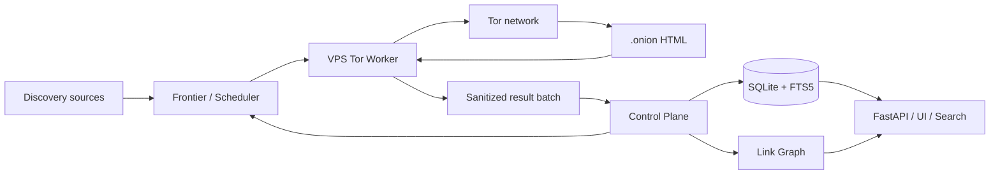

# OnionAtlas

OnionAtlas — автономный движок обнаружения, обхода, индексации и исследования публично обнаружимых `.onion`-сервисов.

Проект задуман не как «один краулер», а как непрерывная исследовательская система: она получает начальные адреса, обходит доступные HTML-страницы через Tor, извлекает новые `.onion`-ссылки, автоматически пополняет очередь, подключает внешние discovery-источники, повторно проверяет ранее недоступные сервисы, строит граф связей и индексирует нормализованный текст для полнотекстового поиска.

Ключевая архитектурная идея: **разделить acquisition и knowledge plane**.

- дешёвый VPS — одноразовый/заменяемый Tor crawl worker;
- постоянный узел (например Raspberry Pi или обычный Linux-сервер) — control plane, scheduler, SQLite/FTS5, граф, история наблюдений, API и UI;
- worker никогда не получает прямой доступ к основной БД;
- JavaScript, браузерный рендеринг, медиа и бинарные файлы отсутствуют в первой итерации;
- основная автономность реализуется детерминированно, без LLM.

## Цель первой итерации

Первая версия должна уметь работать неделями без ручного запуска и самостоятельно поддерживать рост наблюдаемой базы:

1. принимать начальные seed-адреса;
2. отправлять crawl-задания на Tor worker;
3. безопасно загружать только HTML/text;
4. извлекать и нормализовать новые `.onion`-адреса;
5. дедуплицировать их и добавлять во frontier;
6. хранить `first_seen`, `last_seen`, статусы, хеши и историю проверок;
7. индексировать очищенный текст через SQLite FTS5;
8. строить граф входящих/исходящих onion-ссылок;
9. повторно проверять offline-сервисы с backoff;
10. получать новые кандидаты не только из ссылок, но и из внешних discovery-источников;
11. измерять novelty/saturation каждого источника;
12. автоматически переключаться между discovery-ветками при насыщении.

## Высокоуровневая схема

## Что OnionAtlas НЕ пытается делать

- не перебирает всё пространство v3 onion-адресов — это практически невозможно;
- не обещает найти приватный сервис, адрес которого нигде не опубликован;
- не определяет «истинность» владельца только по самому onion-адресу;
- не выполняет JavaScript в первой версии;
- не скачивает изображения, видео, архивы, PDF, документы и исполняемые файлы;
- не предоставляет публичный SOCKS/HTTP proxy;
- не использует LLM для core crawling/scheduling;
- не даёт crawl worker прямой доступ к основной базе.

## Документация

- [Архитектура](docs/ARCHITECTURE.md)
- [Автономный discovery и наращивание базы](docs/DISCOVERY.md)
- [Модель данных](docs/DATA_MODEL.md)
- [Протокол control-plane ↔ worker](docs/WORKER_PROTOCOL.md)
- [Безопасность и границы доверия](docs/SECURITY.md)
- [Эксплуатация и ресурсы](docs/OPERATIONS.md)
- [План v0.1 и критерии готовности](docs/V0.1_PLAN.md)

## Базовые технологические решения

| Область | Решение v0.1 |
|---|---|
| Язык | Python 3.12+ |
| Tor crawling | Tor daemon + SOCKS на loopback |
| Fetch/crawl | Scrapy и/или минимальный async HTTP слой через SOCKS |
| Parsing | lxml / selectolax / BeautifulSoup (окончательный выбор после прототипа) |
| Хранилище | SQLite, WAL |
| Полнотекстовый поиск | SQLite FTS5 + BM25 |
| API | FastAPI |
| Scheduler | собственный детерминированный scheduler поверх SQLite frontier |
| Deployment | systemd |
| Worker | stateless/disposable VPS |
| JS rendering | отсутствует в v0.1 |
| LLM | отсутствует в core v0.1 |

## Источники архитектурных идей

При проектировании учитываются существующие open-source решения, в первую очередь Ahmia crawler/search stack и AIL/Lacus. Первая версия OnionAtlas сознательно проще: без Elasticsearch, Redis, браузерной фермы и тяжёлой threat-intelligence платформы.

До переноса стороннего кода в репозиторий необходимо отдельно проверить лицензию конкретных файлов и зафиксировать происхождение в `THIRD_PARTY.md`. На этапе архитектурной документации код сторонних проектов в OnionAtlas не копируется.

## Статус

Сейчас репозиторий находится на стадии **architecture-first / iteration 0**. Следующий шаг — реализовать минимальный vertical slice:

`seed → Tor fetch → sanitize/parse → SQLite → FTS5 → link discovery → frontier`.
