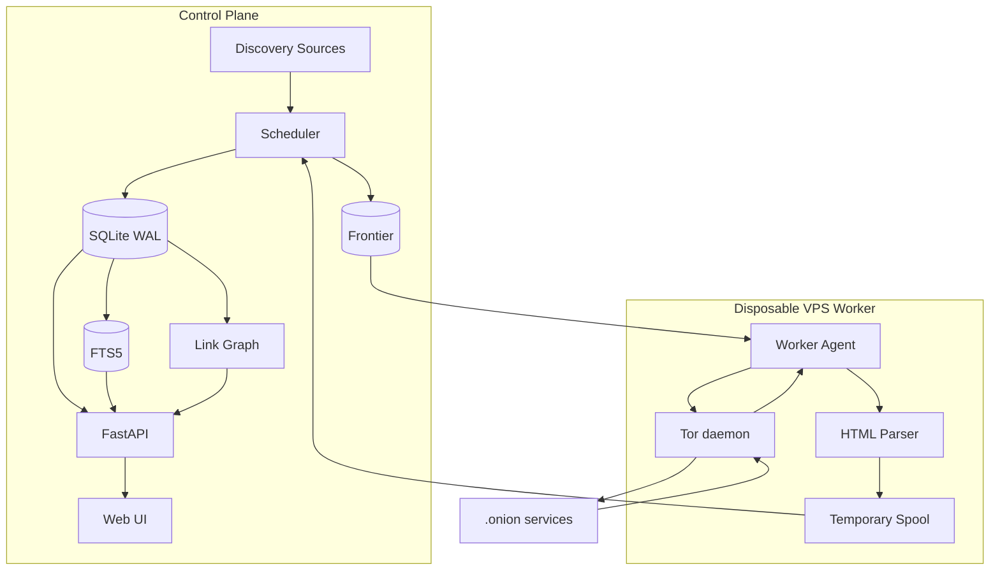
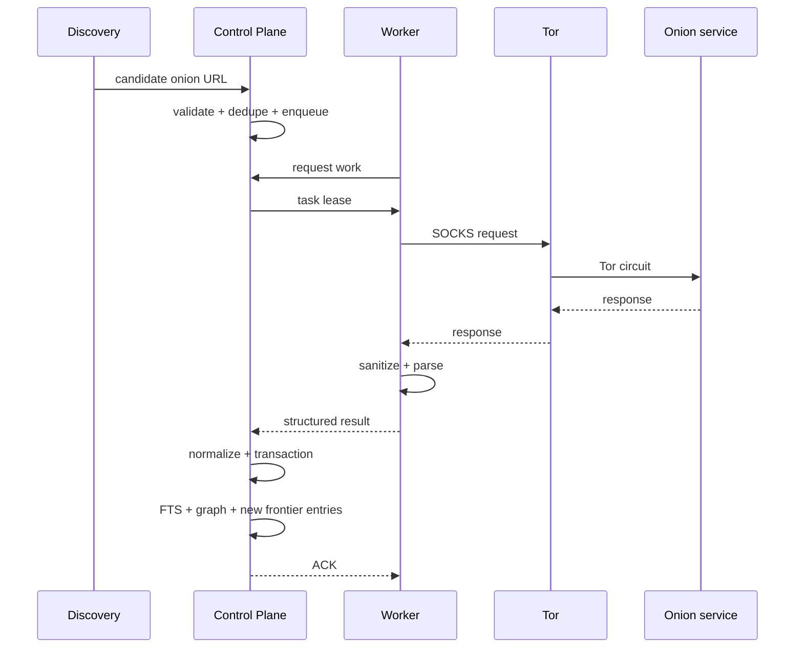
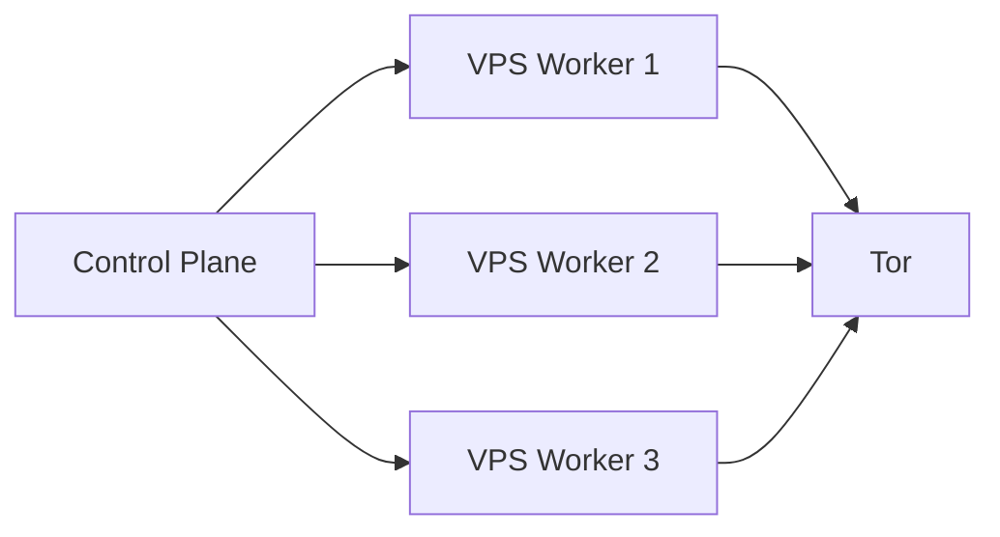

# Архитектура OnionAtlas

## 1. Назначение системы

OnionAtlas — непрерывный discovery/indexing engine для публично обнаружимых `.onion`-сервисов. Главная задача системы — не просто «скачать страницы», а поддерживать постоянно обновляемую исследовательскую базу:

- какие onion-сервисы известны системе;
- откуда был найден каждый адрес;
- когда он впервые и последний раз наблюдался;
- доступен ли он сейчас;
- какие страницы и тексты в нём индексировались;
- на какие другие onion-сервисы он ссылается;
- какие сервисы ссылаются на него;
- как менялся контент;
- насколько конкретный источник discovery продолжает приносить новые адреса.

Архитектура строится вокруг идеи **continuous discovery**, а crawler является только одним из компонентов.

---

## 2. Главные архитектурные принципы

### 2.1. Control plane отделён от acquisition plane

Постоянное состояние системы хранится только на control plane. Crawl worker считается заменяемым и потенциально недоверенным.

Control plane отвечает за:

- canonical state;
- frontier;
- scheduling;
- дедупликацию;
- нормализацию;
- FTS;
- link graph;
- историю;
- enrichment;
- API/UI;
- backup.

Worker отвечает только за:

- получение ограниченного набора URL;
- fetch через Tor;
- проверку response limits;
- безопасное извлечение HTML/text/links;
- возврат структурированного результата;
- краткоживущий spool результатов.

### 2.2. Worker не имеет доступа к основной базе

Запрещается архитектура вида:

`VPS worker → SQLite/PostgreSQL control plane`.

Worker не знает database credentials и не может выполнять произвольные запросы к базе. Даже при компрометации worker злоумышленник не должен автоматически получить исторический индекс OnionAtlas.

### 2.3. Состояние переживает рестарты

Frontier, lease заданий, retry/backoff, crawl history и discovery history должны храниться персистентно. После reboot система продолжает работу с того же состояния.

### 2.4. Детерминированное ядро

Следующие функции не зависят от LLM:

- URL validation;
- canonicalization;
- dedupe;
- scheduling;
- retries;
- extraction;
- FTS indexing;
- graph construction;
- novelty calculation;
- saturation detection;
- source prioritization.

LLM может появиться позже как аналитический слой, но падение LLM никогда не должно останавливать core pipeline.

### 2.5. Минимальная активная поверхность

В v0.1 crawler не запускает JavaScript и не использует Chromium/Playwright. Получаются только HTTP(S)-ответы через Tor, причём сохраняются только разрешённые текстовые типы контента.

---

## 3. Deployment topology

Рекомендуемая минимальная топология:



### Control Plane

Подходит Linux-хост уровня Raspberry Pi 5 или небольшой x86-сервер с SSD.

Критично:

- надёжное постоянное хранилище;
- SQLite с WAL;
- резервное копирование;
- systemd;
- отсутствие прямой публикации БД в интернет.

### Worker

Для первой версии достаточно дешёвого VPS порядка:

- 1 vCPU;
- 1 GB RAM;
- 10 GB disk;
- стабильного исходящего интернет-доступа.

Worker хранит только временные данные и должен быть воспроизводим из конфигурации/Ansible/скрипта без ручного восстановления состояния.

---

## 4. Логические компоненты

## 4.1. Frontier

Frontier — центральная персистентная очередь URL/crawl targets.

Она должна хранить не только URL, но и контекст решения:

- priority;
- depth;
- discovered_from;
- source_id;
- first_discovered_at;
- next_attempt_at;
- attempt_count;
- state;
- lease_owner;
- lease_expires_at;
- last_error_class.

Пример состояний:

- `NEW`
- `QUEUED`
- `LEASED`
- `FETCHED`
- `RETRY`
- `DEAD`
- `SUPPRESSED`

`DEAD` не означает удаление. Это адрес, для которого retries исчерпаны в текущем интервале; scheduler может запланировать долгосрочный recheck.

## 4.2. Scheduler

Scheduler принимает решения:

1. какие URL выдать worker;
2. сколько одновременных заданий разрешить;
3. когда повторно проверить offline service;
4. какой discovery source запустить;
5. когда ветка поиска достигла saturation;
6. какие сайты recrawl чаще.

Scheduler не скачивает сайты самостоятельно.

### Базовый приоритет

Приоритет может учитывать:

- новый onion выше повторной страницы известного сервиса;
- новая ссылка из нескольких независимых источников выше одиночной;
- online service выше repeatedly-offline;
- URL с небольшой depth выше глубокой вложенности;
- high-novelty discovery source выше исчерпанного;
- изменившийся service выше стабильного.

## 4.3. Worker Agent

Worker должен иметь небольшой API/agent loop.

Минимальный цикл:

1. запросить batch;
2. получить `task_id` и targets;
3. подтвердить lease;
4. выполнить fetch через local Tor SOCKS;
5. применить лимиты;
6. разобрать HTML;
7. записать batch result;
8. отправить/выдать control plane;
9. дождаться ACK;
10. удалить временный spool.

При потере связи lease истекает, а control plane имеет право выдать задачу повторно. Следовательно, импорт результатов должен быть идемпотентным.

## 4.4. Tor transport

Tor daemon работает локально на worker.

Требования:

- SOCKS доступен только на loopback;
- никакого публичного `0.0.0.0:9050`;
- worker не является relay/exit/bridge;
- DNS resolution для onion выполняется через Tor-compatible transport;
- прямой fetch `.onion` без Tor запрещён архитектурно.

## 4.5. Safe Fetch Layer

Разрешённые типы для v0.1:

- `text/html`
- `application/xhtml+xml`
- `text/plain` (с ограничениями)

По умолчанию запрещены:

- images;
- audio/video;
- PDF;
- office documents;
- archives;
- executables;
- arbitrary binary responses.

Рекомендуемые стартовые лимиты:

- connect timeout: 30 s;
- total timeout: 90 s;
- redirects: не более 3;
- response body: не более 1–2 MB;
- normalized text: не более 1 MB;
- concurrency: 2 на worker в начальной конфигурации.

Лимиты должны быть конфигурируемыми.

## 4.6. Parser

Parser извлекает:

- final URL;
- status code;
- content type;
- charset;
- title;
- meta description;
- H1;
- cleaned visible text;
- canonical URL (если есть);
- outgoing URLs;
- отдельно outgoing `.onion` URLs;
- redirect chain;
- selected headers;
- response size;
- elapsed time;
- content hash.

`script`, `style`, embedded media и потенциально опасные blob-данные не сохраняются.

## 4.7. Canonicalizer

Canonicalization выполняется на control plane как источник истины.

Для onion service идентичность сервиса определяется hostname. URL внутри сервиса нормализуется отдельно.

Нужно учитывать:

- lowercase hostname;
- удаление default ports;
- удаление fragment;
- аккуратную обработку query;
- нормализацию path без разрушения семантики;
- v3 onion validation;
- защиту от malformed URL.

Нельзя агрессивно удалять query parameters до накопления данных: некоторые сервисы используют их для реальной навигации.

## 4.8. Storage

Основное хранилище — SQLite.

Режим:

- WAL;
- foreign keys ON;
- explicit transactions;
- migrations;
- периодический `PRAGMA optimize`;
- controlled checkpointing;
- backup без копирования «живого» файла некорректным способом.

Полный raw HTML в v0.1 по умолчанию не хранится. Хранятся нормализованный текст, metadata, hashes и links.

## 4.9. FTS5

Индексируемые поля:

- title;
- description;
- h1;
- normalized text.

FTS-документ должен ссылаться на canonical page/service id.

Поиск использует BM25 и snippets. Индекс не является источником истины: его можно перестроить из основной БД.

## 4.10. Link Graph

Каждое наблюдаемое отношение сохраняется как ребро:

`source_page → target_url`.

Для onion-to-onion связи дополнительно строится service-level graph:

`source_service → target_service`.

Для ребра важны:

- first_seen;
- last_seen;
- times_seen;
- anchor text;
- source page;
- target URL;
- crawl run.

Граф нужен не только для UI, но и для discovery ranking.

## 4.11. Discovery Engine

Discovery Engine генерирует новые candidates независимо от текущего frontier.

v0.1 должен поддерживать интерфейс `DiscoverySource` и несколько реализаций:

- link discovery;
- external onion index;
- clearnet discovery;
- dataset/manual import;
- recrawl source.

Детали описаны в `DISCOVERY.md`.

## 4.12. API/UI

FastAPI читает только control-plane state.

Минимальные endpoint-группы:

- `/search`
- `/services`
- `/services/{id}`
- `/pages/{id}`
- `/graph`
- `/stats`
- `/frontier`
- `/runs`
- `/sources`
- `/health`

UI в v0.1 может быть server-rendered. SPA не требуется.

---

## 5. Поток данных

### 5.1. Новый seed



### 5.2. Повторный fetch

Если `content_hash` не изменился:

- обновляется `last_seen`;
- записывается lightweight observation;
- повторная полная индексация текста не нужна;
- outgoing links могут быть обновлены только если parser получил страницу заново.

Если hash изменился:

- обновляется текущий документ;
- сохраняется change event;
- по политике может сохраняться предыдущая normalized revision;
- scheduler временно повышает recrawl frequency.

---

## 6. Согласованность и идемпотентность

Система должна считать повторную доставку результата нормальной ситуацией.

Идемпотентный ключ результата включает как минимум:

- task id;
- canonical URL;
- attempt id;
- fetched_at или response hash.

Control plane не должен дважды увеличивать счётчики/создавать duplicate links при повторной доставке одного результата.

Database import выполняется транзакцией:

1. upsert service;
2. upsert page;
3. insert observation/fetch;
4. update content state;
5. upsert links;
6. create newly discovered frontier entries;
7. update task state;
8. commit.

При ошибке транзакция откатывается полностью.

---

## 7. Масштабирование

### 7.1. Вертикальное

Сначала увеличивается concurrency одного worker только до момента, когда это действительно увеличивает throughput. Tor latency часто является основным ограничением раньше CPU.

### 7.2. Горизонтальное

Добавление worker не требует изменения базы:



Scheduler раздаёт lease разным worker. Worker идентифицируются `worker_id`, но canonical state остаётся единым.

### 7.3. Когда SQLite станет недостаточно

Миграцию на PostgreSQL следует рассматривать не «заранее», а при измеримой необходимости:

- несколько concurrent writers на control plane;
- высокая contention;
- невозможность уложиться в latency при текущем размере БД;
- потребность в сложном распределённом доступе.

До этого SQLite предпочтительнее из-за простоты, backup и низких эксплуатационных расходов.

---

## 8. Отказоустойчивость

### Worker погиб

- lease истекает;
- задача возвращается во frontier;
- новый worker продолжает работу;
- база не теряется.

### Control plane reboot

- systemd запускает services;
- scheduler читает persisted frontier;
- expired leases возвращаются в очередь;
- работа продолжается.

### Tor недоступен

- worker не делает direct fallback;
- задачи получают transport error;
- применяется backoff;
- health state worker меняется на degraded.

### База временно недоступна

- worker сохраняет bounded spool;
- не бесконечно накапливает ответы;
- после достижения лимита прекращает брать новые задания.

### Диск почти заполнен

Control plane должен иметь watermarks, например:

- warning < 20% free;
- stop new crawling < 10% free;
- emergency read-only < 5% free.

Конкретные значения конфигурируемы.

---

## 9. Наблюдаемость

Минимальные метрики:

- known services;
- online/offline/unknown services;
- pages indexed;
- frontier size by state;
- fetch success rate;
- fetch latency p50/p95;
- bytes downloaded;
- new onions/hour/day;
- novelty per source;
- retry count;
- worker health;
- Tor health;
- DB size;
- FTS size;
- free disk;
- batch import latency.

Логи должны содержать task/service identifiers, но не хранить секреты и не дублировать полный page body.

---

## 10. Структура репозитория

Целевая структура:

```text
OnionAtlas/
├── README.md
├── pyproject.toml
├── docs/
├── migrations/
├── src/onionatlas/
│   ├── cli/
│   ├── config/
│   ├── control/
│   │   ├── scheduler.py
│   │   ├── frontier.py
│   │   └── importer.py
│   ├── crawler/
│   │   ├── fetch.py
│   │   ├── parser.py
│   │   ├── policy.py
│   │   └── canonicalize.py
│   ├── discovery/
│   │   ├── base.py
│   │   ├── links.py
│   │   ├── external_index.py
│   │   ├── clearnet.py
│   │   └── recrawl.py
│   ├── db/
│   │   ├── repository.py
│   │   ├── schema.py
│   │   └── fts.py
│   ├── graph/
│   ├── worker/
│   │   ├── agent.py
│   │   ├── spool.py
│   │   └── transport.py
│   ├── api/
│   └── web/
├── tests/
├── scripts/
└── deploy/
    ├── systemd/
    └── examples/
```

---

## 11. Архитектурные решения, зафиксированные для v0.1

1. Control plane и worker разделены.
2. Основная БД находится не на crawler VPS.
3. Worker disposable и stateless с точки зрения проекта.
4. SQLite + WAL — основной store.
5. FTS5 — основной full-text index.
6. Link graph хранится реляционно в SQLite.
7. Tor работает только на worker для fetch.
8. SOCKS слушает только loopback.
9. JavaScript execution отсутствует.
10. Media/binary downloads отсутствуют.
11. Raw HTML не является обязательным артефактом и по умолчанию не хранится.
12. LLM отсутствует в core automation.
13. Discovery — отдельный постоянный loop, а не побочный эффект crawler.
14. Novelty/saturation — обязательная часть discovery с первой итерации.
15. Каждый адрес имеет provenance/evidence trail.
16. Offline service никогда не удаляется только из-за временной недоступности.
17. Worker не получает write-access к основной БД.
18. Все imports идемпотентны.
19. Любой batch может быть безопасно повторён.
20. Система должна продолжить работу после reboot без ручного восстановления очереди.

---

## 12. Что сознательно отложено

Не входит в v0.1:

- Playwright/Chromium rendering;
- screenshots;
- OCR;
- image classification;
- document/PDF parsing;
- login/authenticated crawling;
- CAPTCHA solving;
- automatic form submission;
- LLM classification;
- vector embeddings;
- Elasticsearch;
- Redis;
- distributed DB;
- public multi-user SaaS;
- browser extension.

Эти компоненты могут появляться только после измерения реальной потребности и отдельного security review.
