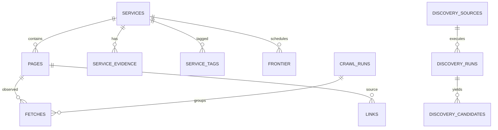

# Модель данных OnionAtlas

## 1. Цели модели

База должна поддерживать одновременно четыре режима работы:

1. operational queue — что нужно проверить сейчас;
2. current knowledge — что известно о сервисе в настоящий момент;
3. historical observations — что наблюдалось раньше;
4. search/graph — быстрый поиск по тексту и связям.

Главное правило: **не смешивать текущее состояние и историю в одну таблицу**.

SQLite является canonical store. FTS5 и производные агрегаты можно перестроить.

---

## 2. Основные сущности



---

## 3. `services`

Одна строка на уникальный onion hostname.

Предлагаемые поля:

```text
id INTEGER PRIMARY KEY
onion_host TEXT UNIQUE NOT NULL
first_seen_at DATETIME NOT NULL
last_seen_at DATETIME
last_online_at DATETIME
last_offline_at DATETIME
current_status TEXT NOT NULL
current_title TEXT
current_description TEXT
current_homepage_page_id INTEGER
current_content_hash TEXT
crawl_count INTEGER DEFAULT 0
success_count INTEGER DEFAULT 0
failure_count INTEGER DEFAULT 0
consecutive_failures INTEGER DEFAULT 0
next_recrawl_at DATETIME
created_at DATETIME NOT NULL
updated_at DATETIME NOT NULL
```

`current_status`:

- `unknown`
- `online`
- `offline`
- `timeout`
- `blocked_by_policy`
- `invalid`

`services` — компактное текущее состояние. История не должна раздувать эту таблицу.

---

## 4. `pages`

Одна canonical page внутри onion service.

```text
id INTEGER PRIMARY KEY
service_id INTEGER NOT NULL
canonical_url TEXT UNIQUE NOT NULL
path TEXT
query TEXT
first_seen_at DATETIME NOT NULL
last_seen_at DATETIME
last_fetch_at DATETIME
current_status_code INTEGER
current_content_type TEXT
current_title TEXT
current_description TEXT
current_h1 TEXT
current_text TEXT
current_text_hash TEXT
current_body_bytes INTEGER
current_requires_javascript BOOLEAN DEFAULT 0
is_homepage BOOLEAN DEFAULT 0
created_at DATETIME NOT NULL
updated_at DATETIME NOT NULL
```

В v0.1 `current_text` хранится в основной БД, а FTS строится поверх него.

---

## 5. `fetches`

Immutable-ish журнал попыток загрузки.

```text
id INTEGER PRIMARY KEY
page_id INTEGER
service_id INTEGER NOT NULL
task_id TEXT
worker_id TEXT
crawl_run_id INTEGER
requested_url TEXT NOT NULL
final_url TEXT
started_at DATETIME NOT NULL
finished_at DATETIME
status_code INTEGER
content_type TEXT
charset TEXT
body_bytes INTEGER
normalized_text_bytes INTEGER
elapsed_ms INTEGER
redirect_count INTEGER
content_hash TEXT
text_hash TEXT
success BOOLEAN NOT NULL
error_class TEXT
error_message TEXT
created_at DATETIME NOT NULL
```

Полный body в `fetches` не хранится.

Это позволяет анализировать:

- uptime;
- latency;
- ошибки;
- worker behaviour;
- изменения content hash.

---

## 6. `page_revisions`

Опциональная таблица истории изменившегося нормализованного текста.

В первой реализации её можно включить, но не сохранять новую revision при каждом одинаковом fetch.

```text
id INTEGER PRIMARY KEY
page_id INTEGER NOT NULL
observed_at DATETIME NOT NULL
text_hash TEXT NOT NULL
title TEXT
description TEXT
h1 TEXT
normalized_text TEXT
supersedes_revision_id INTEGER
```

Новая revision создаётся только если `text_hash` изменился.

Политику retention можно добавить позже.

---

## 7. `links`

Граф URL-level связей.

```text
id INTEGER PRIMARY KEY
source_page_id INTEGER NOT NULL
target_url TEXT NOT NULL
target_service_id INTEGER
anchor_text TEXT
first_seen_at DATETIME NOT NULL
last_seen_at DATETIME NOT NULL
times_seen INTEGER DEFAULT 1
last_fetch_id INTEGER
UNIQUE(source_page_id, target_url)
```

`target_service_id` заполняется, если target — валидный известный onion hostname.

Преимущество: service-level graph можно строить запросом/материализованным агрегатом, не теряя page-level контекст.

---

## 8. `service_edges`

Опциональный агрегированный граф сервисов для быстрого UI/аналитики.

```text
source_service_id INTEGER
target_service_id INTEGER
first_seen_at DATETIME
last_seen_at DATETIME
page_edge_count INTEGER
observation_count INTEGER
PRIMARY KEY(source_service_id, target_service_id)
```

Это derived data. Таблицу можно полностью перестроить из `links`.

---

## 9. `frontier`

Персистентная очередь crawler.

```text
id INTEGER PRIMARY KEY
target_url TEXT UNIQUE NOT NULL
service_id INTEGER
state TEXT NOT NULL
priority REAL NOT NULL DEFAULT 0
depth INTEGER DEFAULT 0
first_discovered_at DATETIME NOT NULL
last_enqueued_at DATETIME NOT NULL
next_attempt_at DATETIME
attempt_count INTEGER DEFAULT 0
lease_owner TEXT
lease_id TEXT
lease_expires_at DATETIME
last_error_class TEXT
source_evidence_id INTEGER
created_at DATETIME NOT NULL
updated_at DATETIME NOT NULL
```

Индексы как минимум:

```text
(state, next_attempt_at, priority)
(lease_expires_at)
(service_id)
```

Выдача работы должна быть атомарной.

---

## 10. `service_evidence`

Provenance любого адреса.

```text
id INTEGER PRIMARY KEY
service_id INTEGER NOT NULL
evidence_type TEXT NOT NULL
source_url TEXT
source_service_id INTEGER
discovery_source_id INTEGER
discovery_run_id INTEGER
query_text TEXT
anchor_text TEXT
snippet TEXT
observed_at DATETIME NOT NULL
is_first_discovery BOOLEAN DEFAULT 0
metadata_json TEXT
```

Пример `evidence_type`:

- `manual`
- `onion_link`
- `external_index`
- `clearnet_official`
- `clearnet_reference`
- `dataset`

Эта таблица нужна для объяснимости: любой адрес должен иметь историю происхождения.

---

## 11. `discovery_sources`

Реестр адаптеров.

```text
id INTEGER PRIMARY KEY
name TEXT UNIQUE NOT NULL
type TEXT NOT NULL
enabled BOOLEAN DEFAULT 1
config_json TEXT
last_run_at DATETIME
next_run_at DATETIME
cooldown_until DATETIME
state TEXT
created_at DATETIME
updated_at DATETIME
```

---

## 12. `discovery_runs`

Каждый запуск источника.

```text
id INTEGER PRIMARY KEY
source_id INTEGER NOT NULL
started_at DATETIME NOT NULL
finished_at DATETIME
query_text TEXT
topic TEXT
raw_candidates INTEGER DEFAULT 0
valid_candidates INTEGER DEFAULT 0
unique_candidates INTEGER DEFAULT 0
new_services INTEGER DEFAULT 0
known_services INTEGER DEFAULT 0
rejected_candidates INTEGER DEFAULT 0
novelty_rate REAL
success BOOLEAN
error_class TEXT
error_message TEXT
elapsed_ms INTEGER
```

Именно по этой таблице scheduler вычисляет saturation.

---

## 13. `discovery_candidates`

Аудит того, что реально вернул source.

Для крупных источников таблица может быть retention-limited, но в v0.1 полезно хранить её полностью.

```text
id INTEGER PRIMARY KEY
run_id INTEGER NOT NULL
raw_value TEXT NOT NULL
canonical_url TEXT
service_id INTEGER
is_valid BOOLEAN
is_new BOOLEAN
reject_reason TEXT
metadata_json TEXT
```

---

## 14. `crawl_runs`

Логические партии/окна crawling.

```text
id INTEGER PRIMARY KEY
started_at DATETIME NOT NULL
finished_at DATETIME
mode TEXT
worker_count INTEGER
scheduled_targets INTEGER
successful_fetches INTEGER
failed_fetches INTEGER
new_services INTEGER
new_pages INTEGER
new_links INTEGER
```

Необязательно делать run жёсткой границей: система непрерывная. Но агрегаты удобны для отчётов.

---

## 15. `workers`

Текущее состояние worker.

```text
id TEXT PRIMARY KEY
name TEXT
registered_at DATETIME
last_heartbeat_at DATETIME
status TEXT
version TEXT
capabilities_json TEXT
current_leases INTEGER
max_concurrency INTEGER
last_ip TEXT
metadata_json TEXT
```

`last_ip` может быть отключён политикой приватности; он не требуется для функциональности.

---

## 16. `service_tags`

Теги могут быть ручными и автоматическими.

```text
service_id INTEGER NOT NULL
tag TEXT NOT NULL
source TEXT NOT NULL
confidence REAL
created_at DATETIME
PRIMARY KEY(service_id, tag, source)
```

В v0.1 автоматическая семантическая классификация не обязательна.

---

## 17. FTS5

Предлагаемая virtual table:

```text
pages_fts(
  title,
  description,
  h1,
  body,
  content='pages',
  content_rowid='id'
)
```

Нужно выбрать external-content или contentless strategy после прототипирования.

Требования:

- индекс перестраиваем;
- обновление происходит после commit canonical page;
- поиск возвращает `page_id`;
- ranking — BM25;
- snippets строятся в query layer.

---

## 18. Индексы

Минимальный набор обычных индексов:

```text
services(onion_host)
services(current_status, next_recrawl_at)
pages(service_id)
pages(last_fetch_at)
fetches(page_id, started_at)
fetches(service_id, started_at)
links(source_page_id)
links(target_service_id)
frontier(state, next_attempt_at, priority)
frontier(lease_expires_at)
service_evidence(service_id, observed_at)
discovery_runs(source_id, started_at)
```

Индексы добавляются по реальным query plans, а не «на всякий случай».

---

## 19. Content hashing

Нужно два разных hash:

- `body/content hash` — по безопасно полученному body или canonical parsed representation;
- `text hash` — по нормализованному видимому тексту.

Это позволяет различать:

- технические изменения HTML;
- реальное изменение индексируемого текста.

Алгоритм: SHA-256 достаточно для дедупликации/изменений. Это не криптографический trust mechanism.

---

## 20. Удаление и retention

По умолчанию сервисы и evidence не удаляются автоматически.

Можно чистить:

- старые duplicate fetch error details;
- oversized diagnostic metadata;
- устаревший worker spool;
- старые identical fetch records после агрегирования, если база станет слишком большой.

Нельзя автоматически удалять только потому, что onion долго offline: историческая ценность сохраняется.

---

## 21. Миграции

Все schema changes должны идти через numbered migrations:

```text
0001_initial.sql
0002_fts.sql
0003_service_edges.sql
...
```

При старте приложение:

1. читает schema version;
2. применяет pending migrations транзакционно;
3. фиксирует migration journal;
4. только потом стартует scheduler.

Production database не изменяется ad-hoc командами приложения.

---

## 22. Backup

Для SQLite WAL нельзя полагаться на случайное копирование одного `.db` файла во время активной записи.

Предпочтительные подходы:

- SQLite backup API;
- `VACUUM INTO` для planned snapshot;
- корректный online backup tool.

Backup должен включать:

- canonical DB;
- конфигурацию;
- migrations;
- secrets отдельно и защищённо.

FTS-derived data можно перестроить, но на первом этапе проще хранить в том же snapshot.

---

## 23. Инварианты

На уровне кода и тестов должны соблюдаться следующие инварианты:

1. `services.onion_host` уникален.
2. Один canonical URL соответствует одной `pages` row.
3. Каждая новая service имеет минимум один evidence record.
4. Worker result не может напрямую создавать дубликат service.
5. Повторный импорт одного task result идемпотентен.
6. Offline status не удаляет предыдущий online history.
7. FTS row всегда ссылается на существующую page.
8. Link target не обязан уже существовать в `pages`, но onion target создаёт/связывает service candidate.
9. Expired lease может быть безопасно выдан повторно.
10. Discovery novelty считается только после canonical dedupe.
