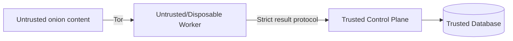

# Безопасность OnionAtlas

## 1. Модель угроз

OnionAtlas регулярно получает данные от неизвестных и потенциально враждебных веб-сервисов. Поэтому crawler worker считается высокорисковой зоной, а control plane — защищаемым ядром.

Ключевые угрозы:

- malicious HTML;
- oversized responses;
- parser bugs;
- redirect abuse;
- попытки заставить worker обращаться к локальным/private ресурсам;
- компрометация worker VPS;
- утечка основной базы через worker;
- публично открытый Tor SOCKS;
- filling disk/memory;
- queue poisoning;
- неконтролируемый рост URL space;
- duplicate/replay result batches;
- вредоносные filenames/content types;
- accidental execution of downloaded content.

---

## 2. Trust boundaries



### Полностью недоверенное

- содержимое страниц;
- HTTP headers;
- redirect targets;
- anchor text;
- URLs;
- external discovery result payloads.

### Ограниченно доверенное

- worker после authentication;
- external discovery adapters.

### Доверенное ядро

- canonicalizer;
- importer;
- DB layer;
- scheduler;
- migrations;
- control-plane configuration.

---

## 3. Worker isolation

Worker должен быть отдельным хостом/VM/VPS, а не тем же сервером, где находится постоянная база.

Минимальные меры:

- непривилегированный system user;
- отдельный working directory;
- systemd hardening;
- минимальный набор пакетов;
- SSH keys вместо passwords;
- firewall;
- automatic security updates по выбранной политике;
- ограниченный spool;
- отсутствие application secrets, не нужных worker.

Worker должен считаться disposable: его можно удалить и пересоздать без потери canonical data.

---

## 4. Tor isolation

Tor SOCKS:

- слушает только `127.0.0.1`/loopback;
- никогда не публикуется в интернет;
- firewall не разрешает внешний доступ;
- worker не является relay;
- worker не является exit;
- worker не является публичным proxy.

Если Tor недоступен, worker **не делает direct fallback** для `.onion` fetch.

---

## 5. SSRF / local network protection

Fetcher должен запрещать переходы с onion target на нежелательные локальные destinations.

Особенно необходимо блокировать:

- loopback URLs кроме внутреннего Tor transport;
- RFC1918/private IP destinations;
- link-local;
- cloud metadata endpoints;
- Unix/socket schemes;
- `file://`;
- `ftp://` и другие неразрешённые schemes.

Redirect policy должна повторно проверять каждый target, а не только исходный URL.

В v0.1 crawler ориентирован прежде всего на onion HTTP(S) content. Clearnet discovery выполняется отдельным адаптером с собственной policy.

---

## 6. Content policy для fetch

Разрешаются только явно перечисленные content types.

Worker обязан остановить download, если:

- Content-Length превышает limit;
- streaming body превысил limit даже при отсутствии/ложном Content-Length;
- content type не разрешён;
- redirect chain превысил limit.

Extension в URL недостаточен для решения: проверяется реальный response content type.

---

## 7. Никакого выполнения контента

В v0.1 запрещены:

- JavaScript;
- browser plugins;
- document viewers;
- macros;
- shelling out в обработчик неизвестного файла;
- автоматическое открытие downloaded artifact;
- image/PDF parsers.

HTML рассматривается исключительно как данные для parser.

---

## 8. Parser safety

Parser должен:

- работать с bounded input;
- иметь timeout на тяжёлую обработку, если потребуется;
- не разрешать external entity resolution;
- не выполнять embedded scripts;
- не загружать subresources;
- аккуратно обрабатывать malformed HTML.

Если parser падает, это `parser_error`, а не повод запускать альтернативный браузер автоматически.

---

## 9. URL explosion protection

Злоумышленник может генерировать бесконечное число URL через query parameters.

Нужны ограничения:

- max discovered links per page;
- max queued pages per service per crawl window;
- max depth;
- canonicalization;
- duplicate detection;
- optional query normalization rules;
- service budget.

Пример initial limits:

```text
max_links_extracted_per_page = 1000
max_new_pages_per_service_per_hour = 500
max_depth = 3
```

Конкретные числа должны стать configurable.

---

## 10. Control-plane importer — главный security gate

Нельзя считать результат worker доверенным только потому, что worker authenticated.

Importer повторно проверяет:

- protocol version;
- task/lease ids;
- URL format;
- size всех текстовых полей;
- link count;
- onion validation;
- timestamp sanity;
- enum values;
- hash format.

Worker payload никогда не превращается напрямую в SQL.

---

## 11. Secrets

Разделить секреты:

- worker credential;
- control API secret;
- external discovery API tokens;
- backup encryption keys;
- SSH credentials.

Worker получает только свой credential.

Секреты:

- не коммитятся в Git;
- не выводятся в обычные логи;
- поддерживают rotation;
- имеют минимальные permissions.

В репозитории только `.env.example`/пример конфигурации без реальных значений.

---

## 12. Database exposure

SQLite file:

- не раздаётся через web server;
- не лежит в static directory;
- не синхронизируется на worker;
- доступен только service account control plane;
- backups защищены так же, как production DB.

FastAPI никогда не предоставляет generic SQL endpoint.

---

## 13. API/UI

Если UI публикуется за пределами localhost/private network:

- authentication обязательна;
- TLS обязателен;
- rate limiting;
- CSRF protection для state-changing endpoints;
- безопасный HTML escaping;
- никакой вставки crawled HTML как trusted markup.

Нормализованный текст показывается как текст, а не как исполняемый HTML.

---

## 14. Logs

Не логировать:

- полный body;
- secrets;
- authentication headers;
- private tokens;
- DB dumps.

Можно логировать:

- task id;
- canonical service id;
- bounded URL;
- error class;
- duration;
- sizes;
- worker id.

Логи ротируются.

---

## 15. Resource exhaustion

### На worker

Ограничить:

- concurrency;
- memory через systemd/cgroup при необходимости;
- spool size;
- response size;
- parser input;
- CPU time;
- open files.

### На control plane

- disk watermarks;
- batch import limits;
- max FTS document length;
- DB maintenance;
- backup retention.

Если свободный диск ниже emergency threshold, scheduler должен остановить новые fetch jobs.

---

## 16. Network egress worker

В идеале worker имеет только необходимый egress:

- Tor bootstrap/network;
- control-plane communication;
- OS updates/DNS по выбранной схеме.

Не следует давать worker доступ к private control-plane LAN кроме строго необходимого endpoint.

---

## 17. Supply chain

Dependencies фиксируются lockfile.

Требования:

- минимизировать зависимости;
- регулярный dependency audit;
- проверять upstream releases;
- не устанавливать crawler plugins из неизвестных источников;
- контейнер не считается заменой обновлению зависимостей.

Сторонний код переносится только после проверки лицензии и происхождения.

---

## 18. Abuse-safe defaults

OnionAtlas не должен автоматически:

- отправлять формы;
- создавать аккаунты;
- логиниться;
- обходить CAPTCHA;
- выполнять действия POST/PUT/DELETE на найденных сайтах;
- эксплуатировать уязвимости;
- brute-force authentication;
- скачивать большие datasets.

Основной режим — пассивное чтение публично доступных HTML GET/HEAD ресурсов.

---

## 19. Backup и recovery

Backup должен быть вне worker и желательно вне единственного control-plane диска.

Необходимо периодически проверять restore, иначе backup считается непроверенным.

Минимальный recovery test:

1. взять snapshot;
2. развернуть временную DB;
3. запустить integrity check;
4. выполнить несколько search/graph queries;
5. убедиться, что migration state корректен.

---

## 20. Security milestones

### v0.1

- no JS;
- no binaries;
- Tor loopback only;
- separate worker;
- strict size/time limits;
- idempotent validated importer;
- no DB access from worker;
- authenticated worker protocol;
- systemd hardening;
- resource watermarks.

### До добавления Playwright

Обязателен отдельный security review:

- network namespaces/container/VM boundary;
- SSRF controls;
- browser sandbox;
- download blocking;
- localhost/private network blocking;
- renderer lifecycle;
- browser patch cadence.

Playwright не должен просто появиться как fallback «если HTML пустой».

---

## 21. Основной принцип

Все внешние данные считаются недоверенными до момента прохождения canonical importer.

Все компоненты проектируются так, чтобы компрометация одного crawl worker не означала компрометацию всей исторической базы OnionAtlas.
